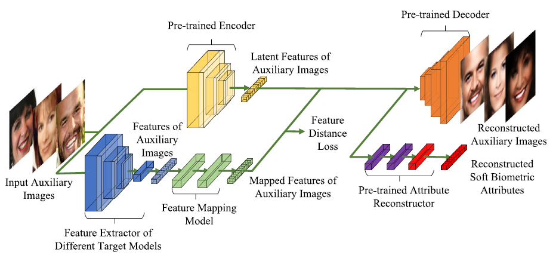

# Mapping-MIA

Official code for paper: **Z. Zhang** , J. Huang, and C. Ding, “Flexible Model Inversion Attack with soft biometric attribute reconstruction against face classifiers,” Journal of Systems Architecture, p. 103739, Feb. 2026, doi: [10.1016/j.sysarc.2026.103739](https://doi.org/10.1016/j.sysarc.2026.103739).



## Abstract

Model Inversion Attack aims to reconstruct private images from their feature vectors. Existing attacks are usually performed by training a reconstruction model over the feature vectors. As the feature vectors outputted by different target models have different distributions and dimensions, a new reconstruction model has to be trained for each target model. Thus, the flexibility of the attack is usually limited. This paper aims to improve the flexibility of model inversion attacks against face classifiers. The relationship between training-based MIA and auto-encoder is studied, and the challenges to improve the flexibility of inversion attacks are analyzed. To improve the flexibility of the attack, Mapping-MIA is proposed. Mapping-MIA consists of a Data Reconstruction Model to reconstruct faces and their soft biometric attributes. This model can be reused for future inversion tasks. Mapping-MIA also contains a lightweight Feature Mapping Model to map the feature vectors from the outputted space of each target model to the latent space of the Data Reconstruction Model. Experimental results show that Mapping-MIA is more flexible against different target models. It achieves similar or better results than existing methods. Further, the reconstructed soft biometric attributes also have an average accuracy of 86.63% on the private dataset.

## Usage

### Hardware Requirements

Any Nvidia GPU with 8GB or larger memory is enough. Larger GPU memory and system memory is better.  The experiments were performed on a PC with a Nvidia RTX 3080 GPU. The code supports both Windows and Linux environment.

### Required Runtime Libraries

* [Anaconda](https://www.anaconda.com/download/)
* [Pytorch](https://pytorch.org/) --  `pip3 install torch torchvision --index-url https://download.pytorch.org/whl/cu129`
* [zhangzp9970/torchplus](https://github.com/zhangzp9970/torchplus) -- `pip install tplus`

The code is compatable with the latest version of all the software.

The LPIPS score is calculated using the [lpips library](https://github.com/richzhang/PerceptualSimilarity) (`pip install lpips`).

The FID score is calculated using the [pytorch-fid program](https://github.com/mseitzer/pytorch-fid) (`pip install pytorch-fid`).

The TFLOPS score is calculated using the ` fvcore.nn.FlopCountAnalysis` function (`pip install fvcore`).

The model parameters are calculated using the following code.

```python
def parameter_count(model: nn.Module =None):  
    return sum(p.numel() for p in model.parameters())
```

The training time is calculated using the relative time mentioned in the tensorboard logging file, and the time difference between model file save time and folder creation time (for the feature mapping model in table 11 only).

### Datasets

The experiments are initially performed on the FaceScrub dataset the CelebA dataset and the MAAAD-Face dataset. We only provide the code for the FaceScrub dataset and the MAAD dataset here. Results on other datasets can also be easily reproduced using these code.

FaceScrub -- The dataset can be downloaded and processed using [these scripts](https://github.com/zhangzp9970/FaceScrub). Crop the images using the official bounding box is enough.

CelebA -- The official dataset with labeled names.

MAAD-Face -- The official dataset, with 7 attributes selected. For convenience, we build two class called `torchplus.data.DataZ` and `torchplus.datasets.DataZFolder` to pack the iamge and its attributes into a single file during the data loading process.

### File Description

* resnetface.py -- train the FaceScrub resnet classifier.
* aeface.py -- train the Data Reconstruction Model.
* nattackface.py -- perform Mapping-MIA.
* testnattackface.py -- export images.

The dataz files are for the MAAD-Face dataset. They are also a good reference for using the `torchplus.data.DataZ` class and the `torchplus.datasets.DataZFolder` class.

## License

Copyright © 2026 Zeping Zhang

This program is free software: you can redistribute it and/or modify it under the terms of the GNU General Public License as published by the Free Software Foundation, either version 3 of the License, or (at your option) any later version. This program is distributed in the hope that it will be useful, but WITHOUT ANY WARRANTY; without even the implied warranty of MERCHANTABILITY or FITNESS FOR A PARTICULAR PURPOSE. See the GNU General Public License for more details. You should have received a copy of the GNU General Public License along with this program. If not, see [http://www.gnu.org/licenses/](http://www.gnu.org/licenses/).

## Citation

```bibtex
 @article{Zhang_Huang_Ding_2026, 
title={Flexible Model Inversion Attack with soft biometric attribute reconstruction against face classifiers}, 
volume={175}, 
ISSN={1383-7621}, 
DOI={10.1016/j.sysarc.2026.103739}, 
journal={Journal of Systems Architecture}, 
author={Zhang, Zeping and Huang, Jie and Ding, Changhao}, 
year={2026}, 
month=june, 
pages={103739} 
}
```

## Acknowledgements

We would like to thank Lan Zhang for discussing and evaluating the qualities of some reconstructed images in this paper. We would also like to thank the Big Data Center of Southeast University for providing the facility support on the numerical calculations in this paper.
